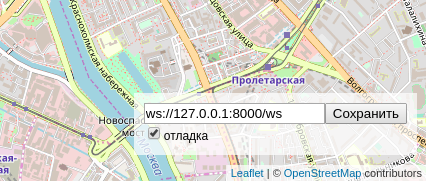

# Автобусы на карте Москвы

Веб-приложение показывает передвижение автобусов на карте Москвы.


## Как установить

Вам понадобится Python версии 3.8 или старше. Для установки пакетов рекомендуется создать виртуальное окружение. 

Установите пакеты:

```python3
pip install -r requirements.txt
```

## Как запустить

Запустите сервер:

```python3
python server.py
```
Для запуска сервера используются следующие необязательные параметры:

`-p, --bus_port`        Порт для имитатора автобусов.

`-r, --browser_port`    Порт для браузера.

`-v, --verbose`         Настройка логирования.


Запустите скрипт имитатора автобусов:

```python3
python fake_bus.py
```
Для запуска имитатора автобусов используются следующие необязательные параметры:

`-s, --server`             Адрес сервера.

`-r, --routes_number`      Количество маршрутов.

`-b, --buses_per_route`    Количество автобусов на каждом маршруте.

`-w, --websockets_number`  Количество открытых веб-сокетов.

`-e, --emulator_id`        Префикс к busId на случай запуска нескольких экземпляров имитатора.

`-t, --refresh_timeout`    Задержка в обновлении координат сервера.

`-p, --path`               Путь к каталогу файлов с маршрутами. По умолчанию `routes`

`-v, --verbose`            Настройка логирования:

| Настройка логирования | Уровень логирования |
| ----------------------| --------------------|
| -v | DEBUG |
| -vv | INFO |
| -vvv | WARNING |
| -vvvv | ERROR |
| -vvvvv | CRITICAL |


Откройте в браузере файл index.html


## Настройки

Внизу справа на странице можно включить отладочный режим логгирования и указать нестандартный адрес веб-сокета.



Настройки сохраняются в Local Storage браузера и не пропадают после обновления страницы. Чтобы сбросить настройки удалите ключи из Local Storage с помощью Chrome Dev Tools —> Вкладка Application —> Local Storage.

Если что-то работает не так, как ожидалось, то начните с включения отладочного режима логирования.

## Формат данных

Фронтенд ожидает получить от сервера JSON сообщение со списком автобусов:

```js
{
  "msgType": "Buses",
  "buses": [
    {"busId": "c790сс", "lat": 55.7500, "lng": 37.600, "route": "120"},
    {"busId": "a134aa", "lat": 55.7494, "lng": 37.621, "route": "670к"},
  ]
}
```

Те автобусы, что не попали в список `buses` последнего сообщения от сервера будут удалены с карты.

Фронтенд отслеживает перемещение пользователя по карте и отправляет на сервер новые координаты окна:

```js
{
  "msgType": "newBounds",
  "data": {
    "east_lng": 37.65563964843751,
    "north_lat": 55.77367652953477,
    "south_lat": 55.72628839374007,
    "west_lng": 37.54440307617188,
  },
}
```

Для работы скрипта генерации фейковых автобусов необходимы json файлы, по одному на каждый маршрут, следующего формата:

```js
{
  "name": "0",
  "station_start_name": "Минаевский пер.",
  "station_stop_name": "Рижский вокзал",
  "coordinates": [
    [
      55.792619645026,
      37.633186182347
    ],
  ],
  "stations": [
    [
      [
        "55.7926196450263",
        "37.6331861823467"
      ],
      "Рижский вокзал"
    ],
  ]
}
```

# Как запустить тесты

Для тестирования используется [pytest](https://docs.pytest.org/en/latest/) с плагином [pytest-trio](https://pytest-trio.readthedocs.io/en/stable/), тестами покрыты фрагменты кода связанные с получением данных от клиента и скрипта генерации фейковых автобусов:

```
python -m pytest server.py
```


## Используемые библиотеки

- [Leaflet](https://leafletjs.com/) — отрисовка карты
- [loglevel](https://www.npmjs.com/package/loglevel) для логгирования

## Цели проекта

Код написан в учебных целях — это урок в курсе по Python и веб-разработке на сайте [Devman](https://dvmn.org).
